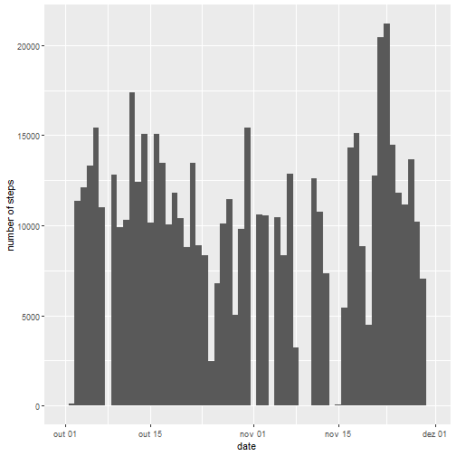
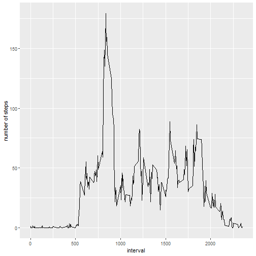
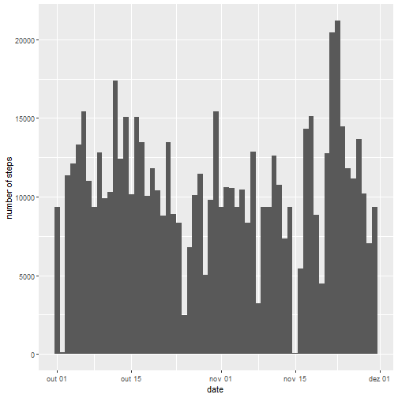
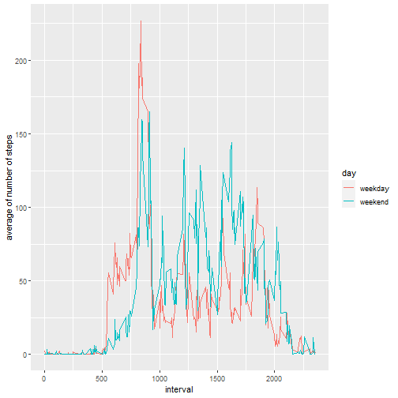

## Loading the libraries, reading the dataset and preprocessing the data


```r
library(tidyverse)

rm(list = ls())

setwd("C:/Users/renat/Programming/R/Coursera/05_Reproducible Research/Week_2")
getwd()
```

```
## [1] "C:/Users/renat/Programming/R/Coursera/05_Reproducible Research/Week_2"
```

```r
activity <- read.csv(
    "C:/Users/renat/Programming/R/Coursera/05_Reproducible Research/Week_2/activity.csv")

activity$date <- as.Date(activity$date)
```

## Mean total number of steps taken per day


```r
mean_day <- activity %>%
    dplyr::group_by(date) %>%
    summarise(agg = sum(steps, na.rm = TRUE))
names(mean_day) <- c("date", "total_steps")
mean_day
```

```
## # A tibble: 61 × 2
##    date       total_steps
##    <date>           <int>
##  1 2012-10-01           0
##  2 2012-10-02         126
##  3 2012-10-03       11352
##  4 2012-10-04       12116
##  5 2012-10-05       13294
##  6 2012-10-06       15420
##  7 2012-10-07       11015
##  8 2012-10-08           0
##  9 2012-10-09       12811
## 10 2012-10-10        9900
## # … with 51 more rows
```

## Histogram of the total number of steps taken each day


```r
ggplot(activity, aes(date)) + geom_histogram(aes(weight = steps),
                                             bins = n_distinct(activity$date)) +
    ylab("number of steps")
```



## Mean and median of the total number of steps taken per day


```r
mean <- mean(mean_day$total_steps)
median <- median(mean_day$total_steps)
mean
```

```
## [1] 9354.23
```

```r
median
```

```
## [1] 10395
```

# Average daily activity pattern


```r
mean_interval <- activity %>%
    dplyr::group_by(interval) %>%
    summarise(agg = sum(steps, na.rm = TRUE),
              avg = agg / n_distinct(activity$date))

ggplot(mean_interval, aes(interval, avg)) + geom_line() +
    ylab("number of steps")
```



## Maximum number of steps in a 5 minute interval


```r
mean_interval$interval[which.max(mean_interval$avg)]
```

```
## [1] 835
```

# Imputing missing values

## Total number of missing values in the dataset


```r
na <- sum(is.na(activity$steps))
na
```

```
## [1] 2304
```

## Replacing the missing values and creating a new dataset


```r
a <- data.frame(activity$interval[which(is.na(activity$steps))])
b <- data.frame(which(is.na(activity$steps)))

replace <- data.frame(a, b)

for(x in 1:nrow(replace)){
    replace[x, 3] <- mean_interval[which((mean_interval$interval == replace[x, 1])), 3]
}

mean_interval_wona <- activity
# mean_interval_wona$steps <- replace_na(mean_interval_wona$steps, replace$interval)

for(x in 1:nrow(replace)){
    mean_interval_wona[replace[x, 2], 1] <- replace[x, 3]
}

mean_interval_wona$steps <- round(mean_interval_wona$steps)
```

## Histogram of the total number of steps taken each day and mean and median total number of steps taken per day


```r
mean_day_wona <- mean_interval_wona %>%
    dplyr::group_by(date) %>%
    summarise(agg = sum(steps))

mean_wona <- mean(mean_day_wona$agg)
median_wona <- median(mean_day_wona$agg)

ggplot(mean_interval_wona, aes(date)) + geom_histogram(aes(weight = steps),
                                             bins = n_distinct(mean_interval_wona$date)) +
    ylab("number of steps")
```




```r
mean_wona
```

```
## [1] 10580.72
```

```r
median_wona
```

```
## [1] 10395
```

There are differences in the histogram and in the mean. The median was the same when imputing missing values.  
When imputing missing data, there is a increase of 13% in steps taken per day.


```r
sum(mean_day_wona$agg)/sum(mean_day$total_steps)
```

```
## [1] 1.131116
```


# Differences in activity patterns between weekdays and weekends


```r
mean_interval_wona$weekdays <- weekdays(mean_interval_wona$date)

mean_interval_wona %>% count(weekdays)
```

```
##        weekdays    n
## 1       domingo 2304
## 2  quarta-feira 2592
## 3  quinta-feira 2592
## 4        sábado 2304
## 5 segunda-feira 2592
## 6   sexta-feira 2592
## 7   terça-feira 2592
```

```r
weekday <- mean_interval_wona %>% distinct(weekdays)
weekend <- weekday %>% slice(6, 7)
weekend <- as.list(weekend)
weekday <- weekday %>% slice(-c(6, 7))
weekday <- as.list(weekday)
# mean_interval_wona %>% n_distinct(weekday)

activity_wona_weekday <- filter(mean_interval_wona, weekdays %in% weekday$weekdays)
activity_wona_weekend <- filter(mean_interval_wona, weekdays %in% weekend$weekdays)

activity_wona_weekday_grouped <- activity_wona_weekday %>%
    dplyr::group_by(interval) %>%
    summarise(agg = sum(steps, na.rm = TRUE),
              avg = agg / n_distinct(activity_wona_weekday$date))
activity_wona_weekday_grouped$day <- "weekday"

activity_wona_weekend_grouped <- activity_wona_weekend %>%
    dplyr::group_by(interval) %>%
    summarise(agg = sum(steps, na.rm = TRUE),
              avg = agg / n_distinct(activity_wona_weekend$date))
activity_wona_weekend_grouped$day <- "weekend"

week_day_end <- rbind(activity_wona_weekend_grouped,
                           activity_wona_weekday_grouped)

ggplot(week_day_end, aes(interval, avg, colour = day)) + geom_line()+
    ylab("average of number of steps")
```


